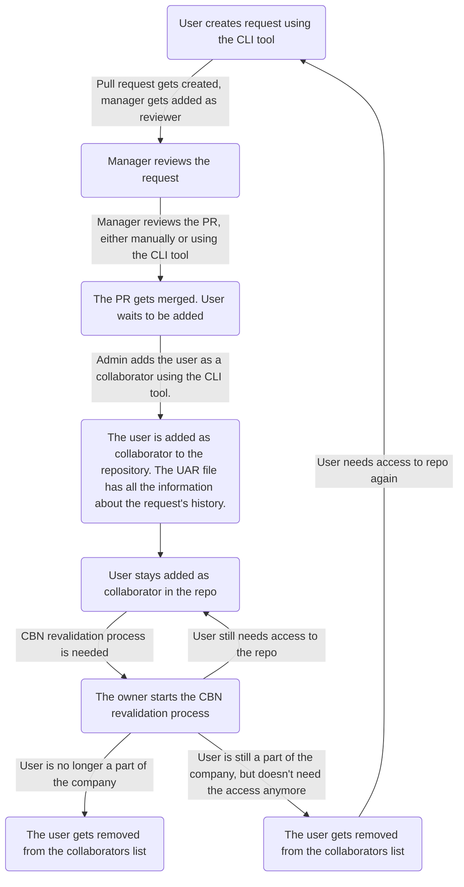

```mermaid
flowchart TD
    A(User creates request using the CLI tool)-->|Pull request gets created, manager gets added as reviewer| B(Manager reviews the request)
    B --> |Manager reviews the PR, either manually or using the CLI tool |C(The PR gets merged. User waits to be added)
    C -->|Admin adds the user as a collaborator using the CLI tool.| D(The user is added as collaborator to the repository. The UAR file has all the information about the request's history.)
    D-->H
    H -->|CBN revalidation process is needed| E(The owner starts the CBN revalidation process)
    E -->|User still needs access to the repo|H(User stays added as collaborator in the repo)
    E -->|User is no longer a part of the company|F(The user gets removed from the collaborators list)
    E -->|User is still a part of the company, but doesn't need the access anymore|G(The user gets removed from the collaborators list)
    G -->|User needs access to repo again|A
```